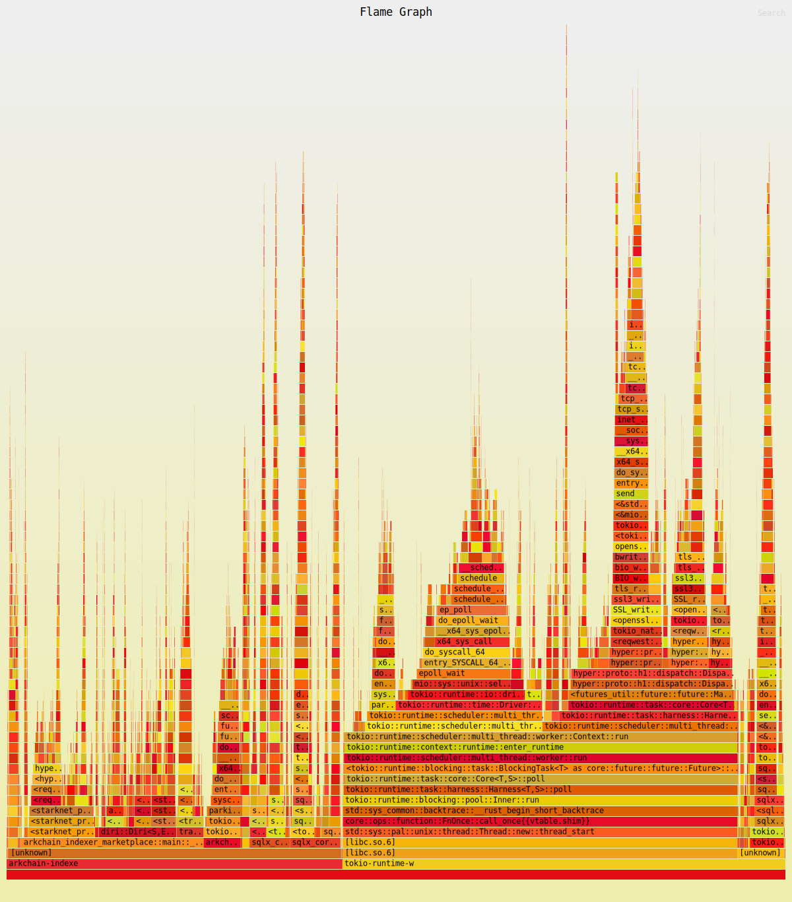

# Performance task to do and code review to fix

## About 
This document aims to product a better performance inside ark-indexer-marketplace project. 
All of the recomandation here should lead to performance improvements reducing lattency issues and ingestion congestion. 

## Current State



## Table of Content 

### - main.rs - l22 -  Change The Memory default Alocator 
#### Report
Using the jmaloc leads to better performance in our case than the use of the default glibc allocator (that rust use by default)
#### Reference 
https://github.com/rust-lang/rust-analyzer/issues/1441
#### Fix - Install
```bash
cargo add tikv_jemallocator
```
#### Fix - Implementation
Before the main function 
```rust
#[global_allocator]
static GLOBAL: tikv_jemallocator::Jemalloc = tikv_jemallocator::Jemalloc;
```

### - main.rs - l25-29 -  Avoid using string Type in struct prefer using &str (will lead to pointers and zero-cpoy), use lifetime parameters to ensure value is valid as long we need.
#### Report
When using string, as long as the value is moved to an another context, it will lead automaticaly to a copy whereas &str will only pass the reference.
#### Reference 
https://stackoverflow.com/questions/24158114/what-are-the-differences-between-rusts-string-and-str
https://doc.rust-lang.org/book/ch10-03-lifetime-syntax.html
#### Fix - Implementation
```rust
struct DatabaseCredentials<'a> {
    username: &'a str,
    password: &'a str,
    dbname: &'a str,
    port: u16,
    host: &'a str,
}
```

### - main.rs - l36-52 -  Avoid using string Type in struct prefer using &str (will lead to pointers and zero-cpoy), use lifetime parameters to ensure value is valid as long we need.
#### Report
The same issue with strings as before
#### Reference 
https://stackoverflow.com/questions/24158114/what-are-the-differences-between-rusts-string-and-str
https://doc.rust-lang.org/book/ch10-03-lifetime-syntax.html
#### Fix - Implementation
```rust
TBD
```

### - main.rs - l36-52 -  Avoid loading env while in runtime ( pefer load .env then store it into Config Variable )
#### Report
Even if it's an initial step, load env each time you need a value leads to take 4ns reading .env file each time you need to read env.
#### Reference 
No Refs
#### Fix - Implementation
Use Envy or any kind of things to load bulk environement data to a config struct ( data latency access optimisation )
ie:
ARK_INDEXER_MARKETPLACE_NAME
ARK_INDEXER_MARKETPLACE_DATABASE_USER
....
```rust 
    match envy::prefixed("ARK_INDEXER_MARKETPLACE_").from_env::<Config>() {
        Ok(config) => {
            ...
        },
        Err(error) => panic!("{:#?}", error),
    }
```

### - main.rs - l36-52 -  Instead of waiting (sleep functions) use timed launch ( the check will be done periodicaly instead of when finishing indexing )
#### Report
Will lead to request pending block with 100% well degined rate ( if they accept 10 request / sec then fetch every 100 ms )
If possible using tokio select you could to something better -> if we use WS 
#### Reference 
No Refs
#### Fix - Implementation
....
```rust 
    let mut interval = tokio::time::interval(Duration::from_millis(100));
    loop {
        // All the example of function runs concurently so you can tick & read message at the same time
        tokio::select! {
            // example if we use any kind of iterator / buffer ( care there it's just an example )
            message = websocket_pipeline.next() => {
                // TBD
            },
            // Periodic Launch
            _ = interval.tick() => {
                info!("Geting last pending block");
                // Code TBD
            }
        }
    }
```

### - main.rs - l1-272 -  Use of arrays instead of vec
#### Report
Using vec leads to a dynamic memory allocation -> will take time at runtime because when pushing data to any vectors it will lead to double the lenght of the data stored to this vec in memory ( Here it's a problem of memory consumption, instructions that lead to CPU waits and L2 cache usage )
#### Reference 
No Refs
#### Fix - Implementation
Evey time it's possible prefers array over Vec ( even if using arrays in some case are painfull )

## Conclusions
#### Report
The project need probably a complete rework ( incremental work without destruct anything - update every days ) in order to be fully optimized. 
This optimization could be done in a range of 5 - 10 days max depending on the 
In terms of architecture a lot of improvement could be done .

In order to do that we can store in memory those principes : 
Websockets if exist : In order to reduce latency ( latency issues ) - Most of the time is taken by http request
Task Paralelism : threat event with asynchronous parralelized tasks ( bottleneck issues )
HTTP Connection Poll : if we use http configure the client to use a pool of connection ( latency issues )
Use a perf oriented pre-cache : we can use DashMap in order to have a concurent access of metadatas ( before going to pgsql )
Bulk tasking : instead of threat block one by one, prefer use bulk threatment in order to have the possibility of ingest Billions of blocks in a short amount of time ( concurency )
Zero copy: avoid using data copy that will lead performance and latency issues ( perfs & latency issues )
Use Clippy when it's possible 
Use FlameGraph when it's possible 
Use Valgrind when it's possible 
